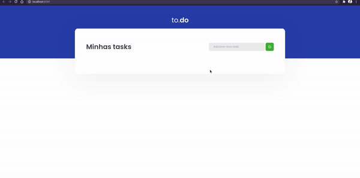

# desafio-01-ignite-reactjs

In this challenge React concepts create an application to train what I have learned so far , 
to train a little more about state handling in React, which was done Add a new task, Remove a task, 
Mark and unmark a task as done.


<h1 align="center">
    
</h1>

<br>

##### Application developed In this challenge React concepts create an application to train what I have learned so far , 
to train a little more about state handling in React, which was done Add a new task, Remove a task, 
Mark and unmark a task as done.

## 🧪 Technologies

Application developed using the following technologies:

- [React](https://reactjs.org)
- [TypeScript](https://www.typescriptlang.org/)
- [Sass](https://sass-lang.com/install)
- [Babel](https://babeljs.io/)
- [React Refresh Webpack Plugin](https://github.com/pmmmwh/react-refresh-webpack-plugin)

## 🚀 Getting started

### Requirements

- You need to install both [Node.js](https://nodejs.org/en/download/) and [Yarn](https://yarnpkg.com/) to run this project.

Clone the project and access the folder.

```bash
$ git clone https://github.com/felipe-gomes-vicente/desafio-01-ignite-reactjs.git
$ cd desafio-01-ignite-reactjs
```

Follow the steps below:
```bash
# Install the dependencies
$ yarn

# Start the project
$ yarn dev
```
The app will be available for access on your browser at http://localhost:8080


## 📝 License

This project is licensed under the MIT License. See the [LICENSE](LICENSE.md) file for details.


---

<p align="center">Made with 💜 by Felipe Vicente👋</p>  

- ## My LinkedIn - [](https://www.linkedin.com/in/felipe-gomes-vicente/) 
